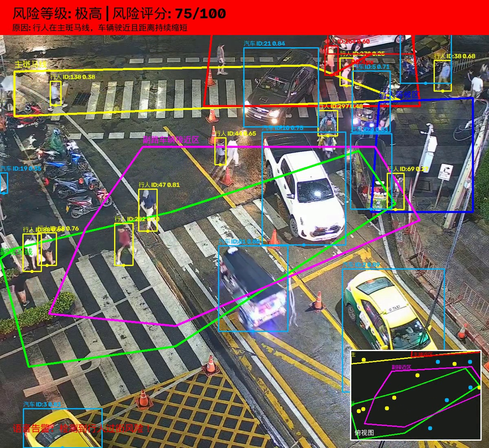
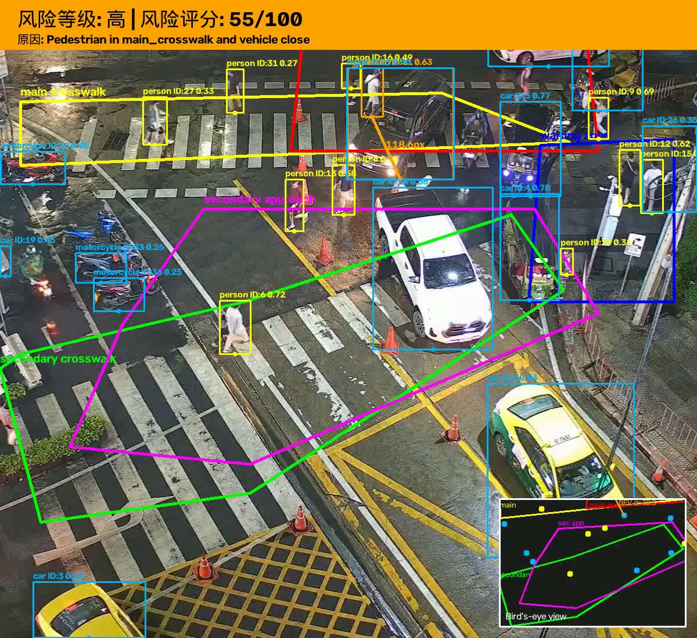
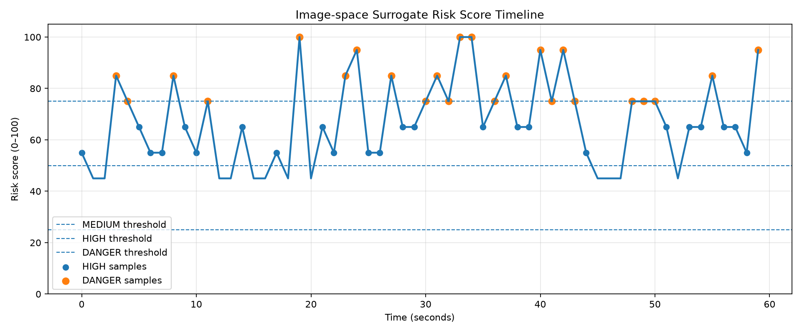

# Vision-based Crosswalk Risk Warning System

## 1. Project Overview

This project implements a computer vision prototype for detecting pedestrian-vehicle risk at unsignalized crosswalks.

The system analyzes CCTV-style crosswalk video using object detection, object tracking, manually defined crosswalk regions of interest, vehicle approach zones, bird's-eye-view visualization, image-space surrogate risk scoring, event logging, screenshot extraction, and English voice warning audio.

The goal is not only to detect pedestrians and vehicles, but also to understand the crosswalk scene and generate warnings when a potentially dangerous pedestrian-vehicle interaction is detected.

---

## 2. Motivation

Pedestrian safety remains an important road-safety issue worldwide. According to the World Health Organization, road traffic crashes cause approximately 1.19 million deaths every year, and more than half of all road traffic deaths occur among vulnerable road users such as pedestrians, cyclists, and motorcyclists.

In South Korea, pedestrian safety is especially important. The ITF/OECD Korea Road Safety Country Profile reported that pedestrians accounted for 35% of all road deaths in Korea in 2022, which is a high share compared with many OECD countries. Seoul has made significant progress in reducing overall traffic fatalities, reaching 180 deaths in 2023 and 1.9 deaths per 100,000 population. However, Seoul continues to invest in pedestrian-oriented infrastructure and crosswalk safety improvements. For example, Seoul reported an 18.4% decrease in traffic accidents after diagonal crosswalk installation, and cases related to failure to protect pedestrians in crosswalks decreased from 34 to 17.

Unsignalized crosswalks are particularly challenging because there is no traffic light to explicitly control the interaction between vehicles and pedestrians. In these locations, vehicles may pass normally when no pedestrian is present, but the situation can quickly become dangerous when a pedestrian enters the crosswalk while a vehicle is approaching.

Therefore, this project focuses on a vision-based pedestrian-vehicle risk warning system for unsignalized crosswalks. The proposed system analyzes CCTV-style video, detects pedestrians and vehicles, estimates risk using image-space surrogate safety indicators, and generates visual and audio warnings when a potentially dangerous interaction is detected.

---

## 3. Main Features

- Pedestrian and vehicle detection using YOLO11s
- Multi-object tracking using ByteTrack
- Main and secondary crosswalk ROI analysis
- Vehicle approach zone analysis
- ROI-aware pedestrian filtering
- Orange bollard/cone false-positive filtering
- Pedestrian-vehicle distance analysis
- Image-space surrogate risk score from 0 to 100
- Risk-level classification: LOW, MEDIUM, HIGH, DANGER
- Frame-level risk logging
- Event-level HIGH/DANGER logging
- Bird's-eye-view mini-map using homography
- Visual warning overlay on output video
- English voice warning audio
- Risk-score timeline plot
- Representative screenshot extraction
- Final H.264 demo video with voice warning
- Experimental real-time webcam deployment mode

---

## 4. System Pipeline

```text
Input CCTV video
→ YOLO11s object detection
→ ByteTrack object tracking
→ Crosswalk ROI analysis
→ Pedestrian and vehicle filtering
→ Image-space surrogate risk scoring
→ Risk-level classification
→ Bird's-eye-view visualization
→ Visual warning overlay
→ Event log and frame log generation
→ English voice warning audio
→ Final H.264 output video
→ Risk-score timeline and representative screenshots
```

---

## 5. Dataset

The input video is a CCTV-style crosswalk video selected from an open dataset source.

The original video source is: 
[https://figshare.com/articles/dataset/video_001_avi_video_040_avi/29983897?file=57418396].

For this project, a 60-second segment was extracted from a longer crosswalk video and used as the main demo input.

```
data/demo/crosswalk_best_60s.mp4
```

The selected scene is an unsignalized crosswalk. Because no traffic light is visible in the scene, the project focuses on pedestrian-vehicle risk analysis rather than traffic-light recognition.

---

## 6. Practical Implementation in Real Life

This project simulates how a real-world unsignalized crosswalk could be enhanced using a vision-based pedestrian-vehicle risk warning system.

In the current prototype, the system analyzes CCTV-style video and generates visual overlays, risk scores, event logs, and simulated English voice warnings. In a practical deployment, the same risk detection logic could be connected to roadside and in-vehicle warning channels.

### 6.1 Deployment Concept

```text
Roadside CCTV Camera
        │
        ▼
Edge Computer / Roadside Server
        │
        ▼
Computer Vision Pipeline
(YOLO11s + ByteTrack + ROI + Risk Scoring)
        │
        ▼
HIGH / DANGER Risk Event
        │
        ├── Roadside speaker warning
        │     → alerts pedestrians and nearby road users
        │
        ├── Driver-facing in-vehicle warning
        │     → dashcam / navigation / V2X / vehicle app
        │
        └── Event logging
              → CSV logs and screenshots for later analysis
```

### 6.2 How the System Operates

1. A CCTV camera continuously monitors the unsignalized crosswalk.
2. The CV pipeline detects and tracks pedestrians and vehicles.
3. The system calculates an image-space surrogate risk score.
4. If the risk level is HIGH or DANGER, the system triggers a warning event.
5. The warning can be delivered in two ways:
   - **Roadside warning**: a speaker near the crosswalk alerts pedestrians and nearby road users.
   - **In-vehicle warning**: risk information can be sent to a dashcam, navigation system, vehicle app, or V2X-enabled driver alert system.
6. HIGH and DANGER events are logged for later analysis.

### 6.3 Why In-vehicle Alerts Are Important

A roadside speaker alone may not be sufficient for drivers inside vehicles because closed windows, music, engine noise, and traffic noise can reduce audibility. Therefore, a practical system should treat the speaker warning as a supplementary cue and use direct driver-facing alerts when possible.

For example, the detected risk event could be sent to:

* a dashcam display
* a navigation system
* a vehicle mobile app
* a V2X-based in-vehicle alert system

This project focuses on the computer-vision risk detection and warning simulation part. The in-vehicle alert integration is proposed as a practical deployment extension.

---

## 7. Object Detection and Tracking

This project uses YOLO11s for object detection and ByteTrack for multi-object tracking.

Detected classes include:
```
person
bicycle
car
motorcycle
bus
truck
```
The system tracks object IDs across frames and uses the bottom-center point of each bounding box as the representative image-space position.

---

## 8. Crosswalk ROI and Scene Understanding

The system uses manually defined regions of interest because the camera view is fixed.

The ROI configuration includes:

* Main crosswalk ROI
* Secondary crosswalk ROI
* Vehicle approach zone
* Secondary vehicle approach zone
* Pedestrian waiting zone
* Homography source points for bird's-eye-view visualization

The ROI file is located at:
```
config/crosswalk_roi.json
```

Each ROI file also records the frame size it was calibrated for (`frame_width` / `frame_height`) and, optionally, a `risk_scale` factor applied to the pixel-based risk thresholds. The pipeline refuses to run when a ROI is applied to a frame of a different size, because its coordinates and thresholds would no longer be meaningful. See section 17 for how a webcam calibration is produced from this file.

Because this is an unsignalized crosswalk, vehicle presence alone is not treated as dangerous. The system increases risk only when pedestrians are inside or near the crosswalk and vehicles are close, approaching, or located in relevant approach zones.

---

## 9. Image-space Surrogate Risk Score

The project computes an image-space surrogate risk score from 0 to 100.

The score is inspired by surrogate safety measures such as minimum distance, closing speed, and time-to-collision-like indicators. However, because this prototype does not perform full real-world metric calibration, the score is computed in image space rather than meters.

The 0–100 score is a heuristic prototype-level score designed for this project, not an official traffic safety index.

The risk score combines:
```
risk_score =
    pedestrian exposure score
  + proximity score
  + closing-speed score
  + TTC-like score
  + approach-zone score
```
### 9.1 Pedestrian Exposure
```
No relevant pedestrian                  → low score
Pedestrian in waiting zone              → medium exposure
Pedestrian inside crosswalk             → high exposure
```
### 9.2 Minimum Distance

Minimum image-space distance between a pedestrian and a vehicle is used as a proximity indicator.

Smaller distance produces a higher risk contribution.

### 9.3 Closing Speed

The system estimates image-space closing speed from tracking history.
```
closing_speed_px_per_frame =
    previous_distance - current_distance
```
If the pedestrian-vehicle distance decreases quickly, the risk score increases.

### 9.4 TTC-like Indicator

The system estimates an approximate TTC-like value in image space:
```
ttc_like_frames = current_distance_px / closing_speed_px_per_frame
ttc_like_sec    = ttc_like_frames / fps
```
This is not a real-world TTC measurement. It is an image-space approximation used for prototype-level risk analysis.

### 9.5 Risk Level Mapping
```
0–24    LOW
25–49   MEDIUM
50–74   HIGH
75–100  DANGER
```

---

## 10. Risk Logic

The final risk level is derived from the risk score.

| Risk Level | Description | Current Prototype Output | Practical Deployment Warning |
|---|---|---|---|
| LOW | No relevant pedestrian in the crosswalk or waiting zone | No warning overlay | No warning |
| MEDIUM | Pedestrian is waiting or moderate surrogate risk is detected | Yellow visual overlay and frame-level logging | Usually monitoring only; no active audio warning |
| HIGH | Pedestrian is crossing or pedestrian-vehicle interaction has high surrogate risk | Orange visual overlay + simulated voice warning in demo video | Roadside speaker can alert pedestrians and nearby road users; driver alert can be delivered through dashcam/navigation/V2X if integrated |
| DANGER | Short TTC-like condition, critical proximity, or very high surrogate risk | Red visual overlay + stronger simulated voice warning in demo video | Strong roadside warning + direct in-vehicle alert through dashcam/navigation/V2X if available |

Example overlay:
```
Risk Level: DANGER | Score: 85/100
Reason: Pedestrian in main_crosswalk and short TTC-like risk detected
```

---

## 11. Bird's-eye-view Visualization

The system includes an approximate bird's-eye-view mini-map using homography.

This visualization helps show the spatial relationship between:

* Pedestrians
* Vehicles
* Crosswalk regions
* Vehicle approach zones
* Dangerous pedestrian-vehicle pairs

The homography is used for visualization only. It is not used as certified metric calibration.

Example result images are saved in:
```
assets/results/
```

---

## 12. Audio Warning Simulation

LOW and MEDIUM states are displayed visually and logged, but they do not trigger an active voice warning in the current prototype.

When a HIGH or DANGER risk event is detected, the system generates an English voice warning.

In the current prototype, the warning is simulated by merging the generated voice audio into the final demo video. Therefore, the demo video shows how the system would behave if it were connected to a real warning device.

### HIGH Event

- Voice message: `Caution. Pedestrian crossing.`
- Meaning: a pedestrian is crossing or entering the crosswalk.
- Current prototype output: orange visual overlay and simulated voice warning in the demo video.
- Practical deployment: a roadside speaker may alert pedestrians and nearby road users. For drivers inside vehicles, a dashcam, navigation system, vehicle app, or V2X-based alert would be more reliable than roadside audio alone.

### DANGER Event

- Voice message: `Warning. Vehicle approaching. Please stop.`
- Meaning: a vehicle is approaching too closely or too quickly while a pedestrian is in or near the crosswalk.
- Current prototype output: red visual overlay and stronger simulated voice warning in the demo video.
- Practical deployment: the system could trigger both roadside warning and direct in-vehicle warning through dashcam/navigation/V2X integration.

### Practical Note

A roadside speaker may not always be audible to drivers inside vehicles because of closed windows, music, engine noise, and traffic noise. Therefore, speaker-based warning should be considered a supplementary warning channel. For direct driver warning, integration with in-vehicle systems such as dashcams, navigation systems, vehicle apps, or V2X devices would be more practical. The current project does not implement real hardware communication with dashcams, navigation systems, or V2X devices; these are proposed deployment extensions.


Generated audio file:
```
outputs/videos/warning_audio_voice.wav
```
Final video with voice warning:
```
outputs/videos/output_crosswalk_risk_yolo11s_60s_with_voice_h264.mp4
```

---

## 13. Output Logs

The project generates two types of CSV logs.

### 13.1 Event Log

The event log records HIGH and DANGER events.
```
outputs/logs/event_log_crosswalk_yolo11s_60s.csv
```
Columns:
```
frame_id
time_sec
risk_level
risk_score
person_count
vehicle_count
min_distance_px
ttc_like_sec
closing_speed_px_per_frame
reason
screenshot_path
```
### 13.2 Frame Log

The frame log records risk status approximately once per second.
```
outputs/logs/frame_log_crosswalk_yolo11s_60s.csv
```
This log is used to generate the risk-score timeline plot.

---

## 14. Risk-score Timeline

The system generates a risk-score timeline plot.
```
assets/results/risk_score_timeline.png
```
This plot shows how the risk score changes over time and marks the MEDIUM, HIGH, and DANGER thresholds.

Example output from the final run:
```
Event log:
HIGH      17
DANGER    11

Frame-level log:
HIGH      24
DANGER    24
MEDIUM    12
```

---

## 15. Representative Results

Representative result images are saved in:
```
assets/results/
```
Example files:
```
assets/results/danger_example_1.jpg
assets/results/high_example_1.jpg
assets/results/crosswalk_risk.mp4
assets/results/risk_score_timeline.png
```
### Danger Example


### High Example


### Risk-score Timeline


### Demo Video
[▶ Click to watch the full 60-second demo video](https://github.com/user-attachments/assets/52e6cc6d-e571-47da-ba9a-b3418d3306b2)

This video demonstrates the full crosswalk scenario with risk overlays, bird's-eye-view visualization, and English voice warnings.

---

## 16. How to Run

### 16.1 Install Dependencies
```
pip install -r requirements.txt
```
### 16.2 Run the Full Pipeline
```
python main.py --config config/config.yaml
```
This command runs:
```
object detection
tracking
risk scoring
visualization
event logging
frame logging
voice warning generation
H.264 video export
risk-score timeline generation
representative screenshot extraction
```
### 16.3 Run Only the Computer Vision Pipeline
```
python main.py --config config/config.yaml --skip-audio
```
This mode skips voice-warning generation and H.264 audio merging.

---
 
## 17. Real-time Webcam Mode

This repository also includes a real-time webcam mode. It runs the same pipeline as `main.py` (detection, tracking, ROI-based risk scoring, visualization, event logging), so the two produce matching risk scores for the same scene.

### 17.1 Calibrate the camera first

`config/crosswalk_roi.json` is calibrated for the 1200x1100 demo video, and the pipeline rejects a ROI whose calibration size does not match the frame it receives. Point the camera at a screen playing that video, then build a calibration for the camera:

```
python tools/make_webcam_roi.py --source 0 --interactive
```

Drag a box around the video on the screen and press ENTER/SPACE, check that the ROI outlines land on the crosswalk, then press `s` to save `config/webcam_roi.json`. Without `--interactive` the screen area can be given directly, and `--frame-size WxH` skips opening the camera:

```
python tools/make_webcam_roi.py --frame-size 1280x720 --rect 100,50,640,480
```

Polygons are mapped by scale and offset into the camera frame, and the resulting `risk_scale` in the output file scales the pixel-based risk thresholds to match, so scoring stays equivalent to the original calibration. The source calibration is never modified.

### 17.2 Run

```
python run_webcam.py --roi-config config/webcam_roi.json --source 0
```

To save webcam output:
```
python run_webcam.py --roi-config config/webcam_roi.json --source 0 --save
```

Press `q` in the preview window to quit. Any video file or RTSP stream can be used in place of the camera index, for example `--source data/demo/crosswalk_best_60s.mp4`, which will need `--roi-config config/crosswalk_roi.json` since that source matches the original calibration.

Note that `config/webcam_roi.json` is camera-specific and is not tracked by git; regenerate it for each camera and mounting position.

---

## 18. Project Structure

```text
vision-based-crosswalk-risk-warning/
├── README.md
├── requirements.txt
├── main.py
├── run_webcam.py
├── config/
│   ├── config.yaml
│   ├── crosswalk_roi.json
│   └── webcam_roi.json        (generated per camera, not tracked)
├── tools/
│   └── make_webcam_roi.py
├── src/
│   ├── audio_warning.py
│   ├── config.py
│   ├── cv_pipeline.py
│   ├── device.py
│   ├── locales/
│   ├── report_assets.py
│   └── roi_transform.py
├── data/
│   └── demo/
│       └── crosswalk_best_60s.mp4 
├── assets/
│   └── results/
│       ├── danger_example_1.jpg
│       ├── high_example_1.jpg
│       ├── crosswalk_risk.mp4
│       └── risk_score_timeline.png
└── outputs/
    ├── logs/
    │   ├── event_log_crosswalk_yolo11s_60s.csv
    │   └── frame_log_crosswalk_yolo11s_60s.csv
    └── videos/
        ├── output_crosswalk_risk_yolo11s_60s_with_voice_h264.mp4
        └── warning_audio_voice.wav
```
---

## 19. Limitations
* The current prototype estimates image-space closing speed, but it does not measure real vehicle speed in meters per second or kilometers per hour.
* Real-world speed measurement would require metric calibration or additional sensors such as radar, LiDAR, induction loops, or two-point average-speed measurement.
* The system uses image-space distance, not real-world metric distance.
* ROI regions are manually defined for the selected fixed CCTV view.
* Homography is approximate and used mainly for bird's-eye-view visualization.
* The TTC-like value is an image-space approximation, not a calibrated physical TTC.
* The system may be affected by occlusion, lighting changes, and small distant pedestrians.
* YOLO may produce false positives or miss objects in difficult conditions.
* Voice warning is simulated and not connected to real speaker hardware, dashcam systems, navigation systems, or V2X devices.
* Webcam mode requires camera-specific ROI calibration (`tools/make_webcam_roi.py`) for full risk scoring.
* The webcam ROI is derived from the demo video's calibration by scale and offset, so it assumes the camera roughly faces the screen without strong perspective distortion. Re-calibrating by hand is more accurate for a permanent installation.

---

## 20. Future Work

* Metric homography calibration using real-world crosswalk measurements
* Real-world vehicle speed estimation in meters per second or kilometers per hour
* Radar, LiDAR, or two-point average-speed camera integration for more reliable speed estimation
* Post-Encroachment Time estimation using conflict-point crossing times
* Automatic crosswalk segmentation
* More robust pedestrian trajectory prediction
* Real IoT speaker integration
* Integration with dashcam or navigation systems for direct driver alerts
* V2X-based driver warning delivery
* Vehicle app notification system for approaching vehicles
* Multi-camera deployment
* Weather/nighttime robustness testing
* Multilingual warning messages

--- 

## 21. References

* World Health Organization. Global status report on road safety 2023.  
  https://www.who.int/teams/social-determinants-of-health/safety-and-mobility/global-status-report-on-road-safety-2023

* World Health Organization. Road traffic injuries fact sheet.  
  https://www.who.int/news-room/fact-sheets/detail/road-traffic-injuries

* International Transport Forum / OECD. Korea Road Safety Country Profile 2023.  
  https://www.itf-oecd.org/sites/default/files/korea-road-safety.pdf

* Seoul Metropolitan Government. Seoul's Traffic Mortality Hit a Record Low in 2023.  
  https://english.seoul.go.kr/seouls-traffic-mortality-hit-a-record-low-in-2023-dropping-below-2-fatalities-per-100000-capita-for-the-first-time-among-local-governments/

* Seoul Metropolitan Government. Seoul Expands Installation of Diagonal Crosswalks After 18% Drop in Traffic Accidents.  
  https://english.seoul.go.kr/seoul-expands-installation-of-diagonal-crosswalks-after-18-drop-in-traffic-accidents/

* Ultralytics YOLO documentation.  
  https://docs.ultralytics.com/

* ByteTrack: Multi-Object Tracking by Associating Every Detection Box.  
  https://github.com/ifzhang/ByteTrack
  
* OpenCV documentation.  
  https://docs.opencv.org/

* gTTS documentation.  
  https://gtts.readthedocs.io/

* pydub documentation.  
  https://github.com/jiaaro/pydub
